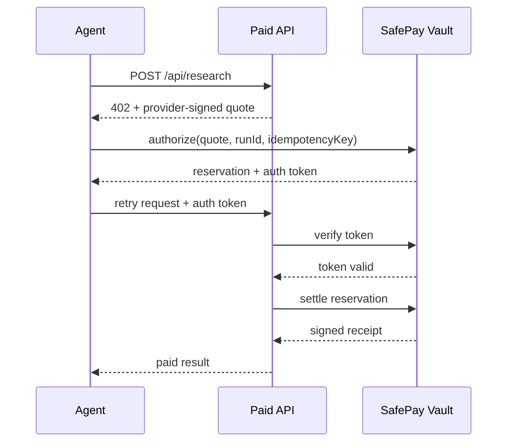
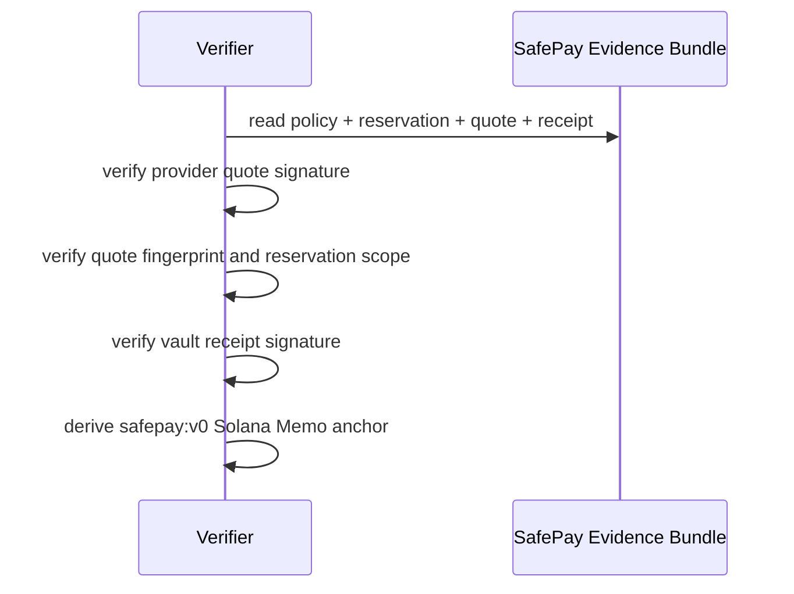

# Architecture

SafePayKit separates the payment flow into four concerns:

1. `policy-schema`
   Defines the shared policy, quote, reservation, and receipt shapes.

2. `core`
   Deterministic spend rules:
   - authorize
   - reuse idempotent reservation
   - settle
   - refund
   - trip / reset breaker

3. `vault-service`
   Holds the spend authority, enforces policy, issues short-lived authorization tokens, signs settlement receipts, and persists local runtime state.

4. `x402-client` + provider
   The client handles `402 Payment Required`, obtains authorization from the vault, and retries safely against a paid API provider.

5. `conformance`
   The verifier checks the evidence bundle independently: provider quote
   signature, reservation scope, vault receipt signature, and Solana
   Memo-compatible anchor payload.

## Flow

## Evidence Flow

## Safety Wedge

The novelty is not “agent payments.” The novelty is safe spend control around retries:

- budget reservation before settlement
- provider-signed quote verification
- idempotent reservation reuse
- recipient / route policy enforcement
- TTL expiry
- signed receipts
- independent receipt evidence verification
- Solana Memo-compatible receipt anchor payloads
- audit log and breaker state
- restart-safe local persistence
